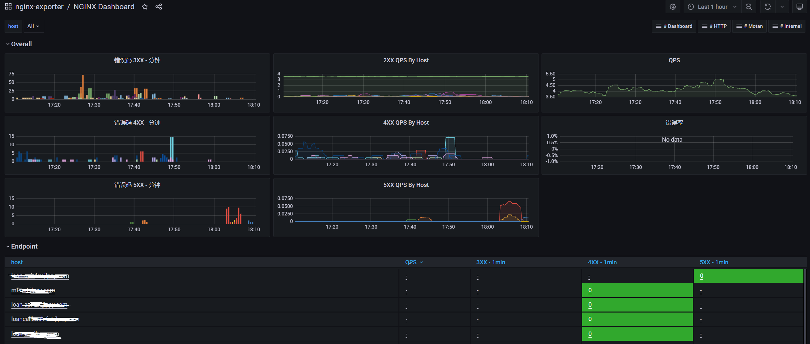
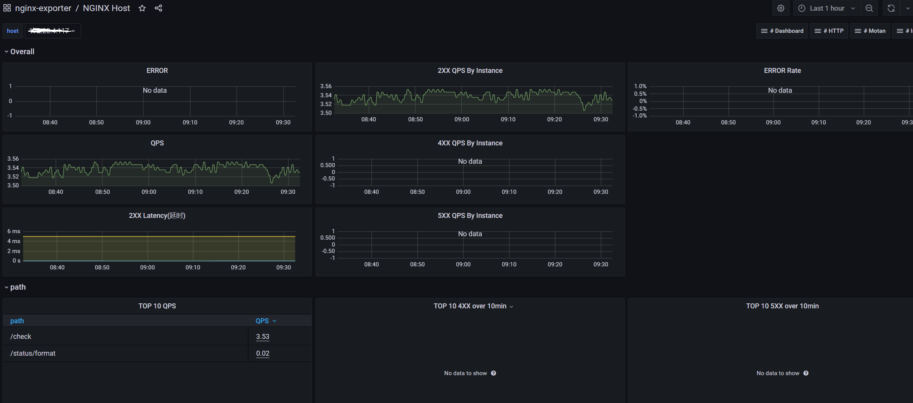
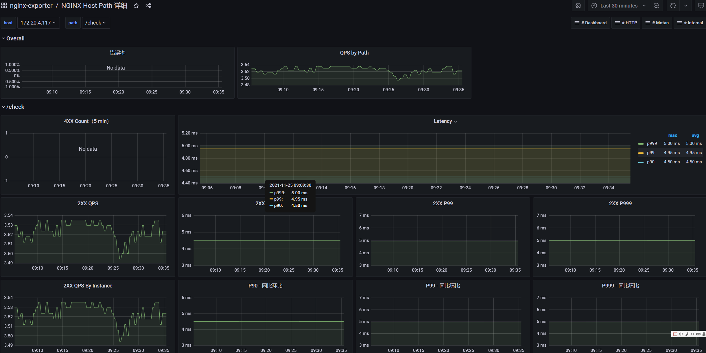

# nginx_exporter

#### 介绍
从ingress-nginx官方代码中的expoter迁移出来 用来监控虚拟机上的nginx的expoter    
基于官方  controller-v0.49.3 版本移植的代码

#### 软件架构
nginx 通过lua模块monitor.lua 将nginx log 以json格式发到 `/tmp/prometheus-nginx.socket`, nginx_exporter 通过这个socket获得数据并组装成metrics。 

nginx_process 通过采集 /proc/PID/ 目录下面的数据，监控cpu、memory、IO ;  

nginx_status 通过 http_stub_status_module 模块采集nginx的连接数据，nginx编译时要加上 --with-http_stub_status_module;
配置文件要加上
```nginx
    #监控使用端口
    server {
        listen 8021;
        location /stub_status{
           stub_status on;
           access_log off;
           allow 127.0.0.1;
           # deny all;
        }
    }         
```

#### 依赖
1） nginx 必须要编译有lua模块     
2） lua 必须要有 cjson 模块


#### 安装luajit 和 cjson
```shell
yum install gcc -y

cd /usr/local/src/
wget --no-check-certificate https://luajit.org/download/LuaJIT-2.0.5.zip 
unzip LuaJIT-2.0.5.zip
cd LuaJIT-2.0.5/
make install PREFIX=/usr/local/luajit 

cd /usr/local/src/
wget --no-check-certificate https://kyne.com.au/~mark/software/download/lua-cjson-2.1.0.zip
unzip lua-cjson-2.1.0.zip 
cd lua-cjson-2.1.0/
# 这里要修改makefile文件，不然编译报错
sed -i 's#^LUA_INCLUDE_DIR = .*#LUA_INCLUDE_DIR =   /usr/local/src/LuaJIT-2.0.5/src#' Makefile
make && make install 
```


#### 使用说明

1.  将Lua脚本copy到 /data/nginx/lua 目录（这个目录可以自己定义，和nginx配置文件一致就行）;

2.  修改nginx的http模块配置，新增如下配置
```nginx
http {

    # lua脚本的目录路径
    lua_package_path "/data/nginx/lua/?.lua;;";

    init_by_lua_block {
        collectgarbage("collect")

        -- init modules
        local ok, res

        ok, res = pcall(require, "monitor")
        if not ok then
                error("require failed: " .. tostring(res))
        else
                monitor = res
        end

        ok, res = pcall(require, "plugins")
        if not ok then
                error("require failed: " .. tostring(res))
        else
                plugins = res
        end
        -- load all plugins that'll be used here
        plugins.init({  })
    }

    init_worker_by_lua_block {
        monitor.init_worker(10000)
        plugins.run()
    }

    log_by_lua_block {
        monitor.call()
        plugins.run()
    }
    
......
}

```

3.  启动nginx_exproter
```shell
# 编译ngx_exporter
git clone https://gitee.com/xianglinzeng/nginx_exporter.git
cd nginx_exporte
go mod tidy
go build -o nginx_exporter

# nginx_exporter 参数
# -port 指定启动端口，默认9123端口
# -v    指定日志级别  1 2 3 4 5 越高日志越详细，默认是2，不指定也行，调试使用5
./nginx_exporter -port=9999 -v=5


# 使用systemd管理
mkdir /opt/nginx_exporter
cp nginx_exporter /opt/nginx_exporter

cat <<EOF > /usr/lib/systemd/system/nginx_exporter.service
[Unit]
Description=nginx_exporter
After=network.target

[Service]
User=root
Group=root
Type=simple
ExecStart=/opt/nginx_exporter/nginx_exporter -port=9123 -v=2
Restart=on-failure

[Install]
WantedBy=multi-user.target
EOF

systemctl daemon-reload
systemctl daemon-reload
systemctl restart nginx_exporter
systemctl status nginx_exporter.service
systemctl enable nginx_exporter

curl localhost:9123/metrics
```


4.  使用ServiceMonitor添加到prometheus-opertor
```yaml
---
apiVersion: monitoring.coreos.com/v1
kind: ServiceMonitor
metadata:
  labels:
    prometheus: k8s
    k8s-apps: nginx-exporter
  name: nginx-exporter-sm
  namespace: monitoring
spec:
  endpoints:
  - port: metrics
    interval: 10s
    Scheme: http
    path: /metrics
  jobLabel: k8s-app
  selector:
    matchLabels:
      metrics: nginx-exporter

---
apiVersion: v1
kind: Service
metadata:
  labels:
    # ServiceMonitor 自动发现的关键label
    metrics: nginx-exporter
  name: nginx-exporter
  namespace: monitoring
spec:
  ports:
  - name: metrics
    #对应 ServiceMonitor 中spec.endpoints.port
    port: 9123
    targetPort: 9123
---
apiVersion: v1
kind: Endpoints
metadata:
  name: nginx-exporter
  namespace: monitoring
  labels:
    metrics: nginx-exporter
subsets:
  - addresses:
      - ip: 172.20.4.117
    ports:
      - name: metrics
        port: 9123
        protocol: TCP 
```


#### 告警规则
| 报警名称  |  表达式 | 采集数据时间（分钟）| 报警触发条件 |
| --------   | :------:   | :----: | :----: |
| NginxHighHttp4xxErrorRate | sum(rate(nginx_http_requests_total{status=~"^4.."}[1m])) / sum(rate(nginx_http_requests_total[1m])) * 100 > 5 | 5 | HTTP 4xx错误率过高。 | 
| NginxHighHttp5xxErrorRate | sum(rate(nginx_http_requests_total{status=~"^5.."}[1m])) / sum(rate(nginx_http_requests_total[1m])) * 100 > 5 | 5 | HTTP 5xx错误率过高。| 
| NginxLatencyHigh | histogram_quantile(0.99, sum(rate(nginx_http_request_duration_seconds_bucket[10m])) by (host, node)) > 10 | 5 | 延迟过高。


#### grafana 
作图参考这个: https://github.com/zrbcool/prometheus-lua-nginx 





